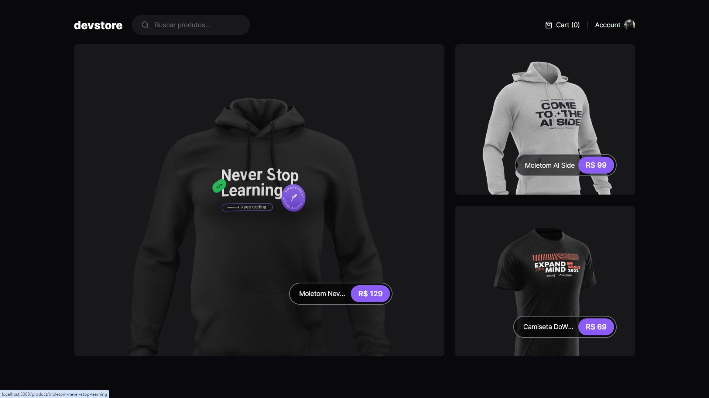
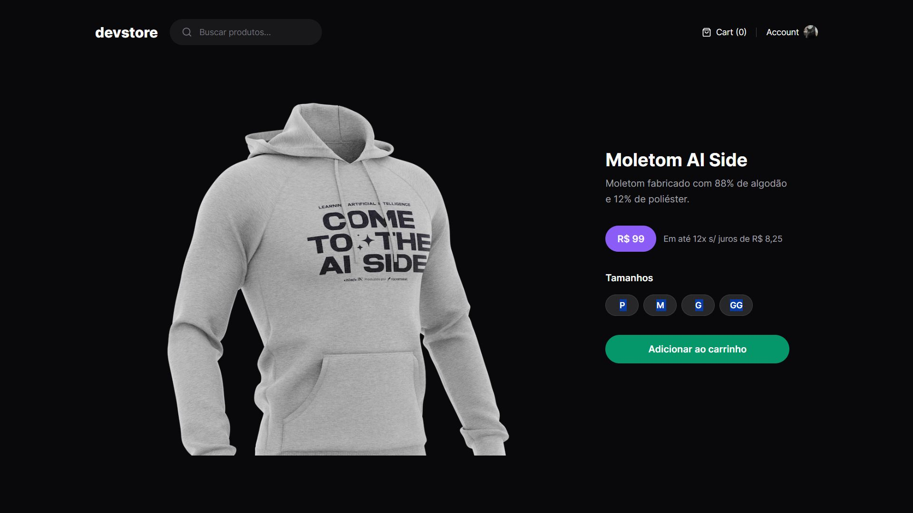
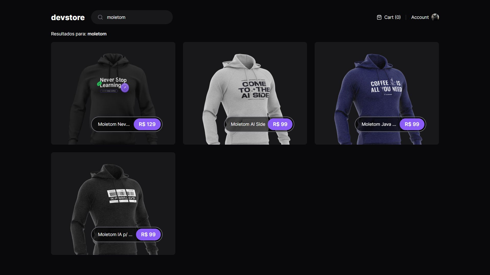

<h1 align="center"> Dev Store 😎</h1>

Uma simples aplicação full-stack, sobre um breve e-commerce, foi feita com o intuito de aprender tecnologias novas, como, por exemplo, Next.js, e também conhecer outras ferramentas, como o Cypress, que é uma ferramenta para Testes E2E

A aplicação é bastante simples, possuindo poucas funcionalidades, como a pesquisa por itens, no caso, Moletom e Camiseta, e os itens mais desejados podem ser adicionados ao carrinho.

Como citado acima, foi utilizado o Cypress, que foi um grande facilitador para realizar os Testes E2E da aplicação e visualizar uma situação real de um usuário navegando pelo site. Nas imagens abaixo, podem ser vistos os testes.

A aplicação possui também a função do GitHub Actions, que é uma ferramenta integrada ao GitHub, permitindo que você automatize o processo de construção, teste e implantação de seus projetos diretamente do repositório.

Como eu havia dito, foi feito apenas para testar ferramentas novas e aprofundar o conhecimento em Front-End. Futuramente, pretendo aprimorar essa aplicação e adicionar mais funcionalidades a ela.

  
  
  

## Tecnologias

- [Next](https://nextjs.org/)
- [Cypress](https://www.cypress.io/)
- [Node](https://nodejs.org/en)
- [Vercel](https://vercel.com/)

## Api do projeto
- [Deploy](devstore-api-ebon.vercel.app)

## Autor

