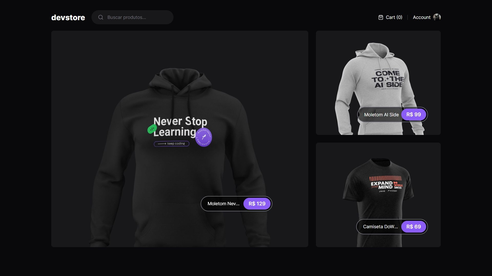

# Dev Store

Desenvolvido para aprimorar meus conhecimentos em desenvolvimento front-end, este é um e-commerce simples com funcionalidades como pesquisa de itens e adição/remoção de itens no carrinho.

## Configurações 

- Clone o repositório
- Entre na pasta (`dev-store-app`)
- Instale dependências (`pnpm i`) 
- Configure o arquivo `.env`
- Clone e rode a [API](https://github.com/matheusgmello/devstore-api) ou utilize o [Deploy](https://devstore-api-ebon.vercel.app/)
- Rode a aplicação (`pnpm run dev`)
- Se quiser rode o Cypress para testes (`pnpm cypress open`)

## Tecnologias 

- [Next Js](https://nextjs.org/)
- [Cypress](https://www.cypress.io/)
- [Node](https://nodejs.org/en)
- [Vercel](https://vercel.com/)

<!--START_SECTION:footer-->
 

## 🔗 Connect with me

<!--END_SECTION:footer-->

